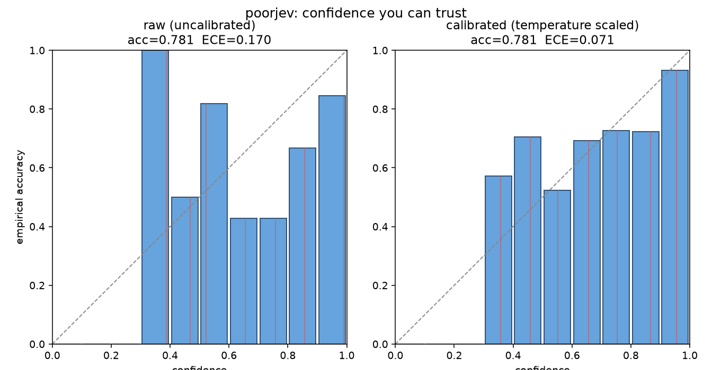

# poorjev

**the poor man's Jev.**

Poor in price. Rich in honesty. Typed decisions with confidence that is actually
calibrated, not vibes. Runs on your laptop. No API key. No waitlist.

```bash
pip install poorjev
```

```python
from poorjev import Choice, Score, Noul

topic = Choice(["billing", "technical", "account", "other"])
ans = topic.decide([2.4, 0.1, 0.3, 0.0])   # a backend supplies these scores

ans.value        # "billing"          (always one of your options, by construction)
ans.confidence   # 0.86               (calibrated once you fit the calibration layer)
ans.probs        # {"billing": 0.86, "account": 0.07, ...}
```

## Why

Most production AI work is fast structured decisions, route, classify, extract,
score, gate a tool call, not chat. Jev nailed that thesis but is a hosted
waitlist. poorjev gives you the same typed-question interface locally, and it is
the one that proves its confidence is real.

Everyone ships an LLM in JSON mode and calls the `0.9` a "confidence." It is a
vibe. poorjev proves its `0.9` actually means `0.9`: on the shipped eval set,
temperature scaling cuts calibration error (ECE) from 0.170 to 0.071 with no
loss of accuracy, measured 5-fold held-out.



Left: raw confidences are overconfident. Right: calibrated, the bars hug the
diagonal, so a stated 0.8 really is right about 80% of the time. Full numbers in
`RESULTS.md`.

## Status

Early build. Shipped so far:

- **M1, the contract.** Three primitives (`Choice` / `Score` / `Noul`) and typed
  answers. Schema validity is structural: the returned `value` is always drawn
  from your declared set, proven against adversarial inputs (NaN, inf,
  negatives, all-zero) in the test suite. This is Jev's "0 type errors" claim,
  made honest.
- **M2, the local backend.** `Client().ask(state, {...})` runs every question in
  one batched pass through a keyless NLI model (`pip install 'poorjev[local]'`,
  one ~400MB download, then offline). See `examples/ticket_router.py` and
  `examples/tool_gate.py`.
- **M3, the eval set + metrics.** 55 hand-labelled items / 160 decisions, and
  `poorjev eval` reporting accuracy, ECE, Brier, and risk-coverage.
- **M4, calibration (the point of the project).** `poorjev calibrate` fits
  temperature scaling and a conformal abstention threshold, cutting ECE
  0.170 -> 0.071 (5-fold held-out) and giving honest "I don't know" behaviour.
  `Client(temperature=T)` then returns calibrated confidence from `ask()`.

**Practical note on phrasing.** The local model is strong at concrete entailment
("this moves money", "this deletes data", "the customer wants to cancel") and
weak at abstract value judgements ("this is dangerous", "this is important").
Ask concrete questions and let a rule apply the policy. For harder reasoning,
the optional `[llm]` backend (M5) is the intelligence dial.

Next: M5 optional LLM backend (the intelligence dial), M6 ship. See `PRD.md`.

## What this is not

Not a Jev clone weights-wise, not a hosted API, and no speed claims. It is
interface-compatible and honestly calibrated, on commodity models. The name is
playful; the numbers are not.

MIT licensed.
