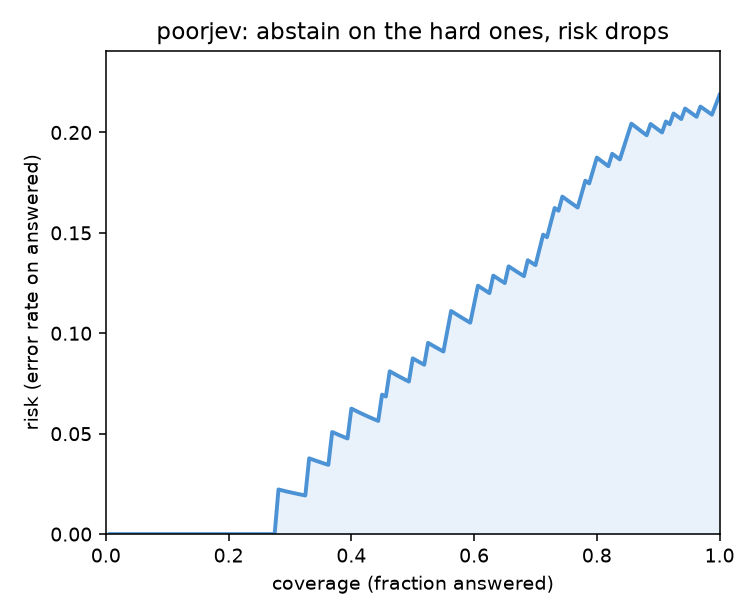

<h1 align="center">poorjev</h1>

<p align="center"><b>The poor man's Jev.</b> An open source, local-first "System One" decision layer for LLM apps: typed decisions with <b>provably calibrated confidence</b>. No API key. No waitlist.</p>

<p align="center">
  
  
  <a href="https://github.com/rupeshpoojary9/poorjev/actions/workflows/tests.yml"></a>
  
  
</p>

---

**Your model's `0.9` is a vibe. poorjev's `0.9` is a measurement.**

Every LLM-in-JSON-mode hands you a confidence score and hopes you don't check it. poorjev checks it. On the shipped eval set it cuts calibration error (ECE) from **0.170 to 0.071** with zero loss of accuracy, and it runs on your laptop with no API key.

<p align="center">
  
</p>

<p align="center"><i>Left: raw confidences, overconfident. Right: calibrated, a stated 0.8 really is right about 80% of the time.</i></p>

## Quickstart

```bash
pip install "poorjev[local]"
```

> PyPI publish is pending. Until then: `pip install "poorjev[local] @ git+https://github.com/rupeshpoojary9/poorjev"`

```python
from poorjev import Client, Choice, Score, Noul

client = Client()  # local model, no key, offline after one download

result = client.ask(
    state="I've emailed three times and I'm STILL being double-charged. Cancel my account today.",
    questions={
        "topic":        Choice(["billing", "technical", "account", "shipping", "other"]),
        "frustration":  Score(levels=["low", "medium", "high"]),
        "is_urgent":    Noul("The customer needs a response today."),
        "wants_cancel": Noul("The customer wants to cancel their account."),
    },
)

result["topic"].value          # "billing"      always one of your options, by construction
result["topic"].confidence     # 0.86           calibrated, not a vibe
result["frustration"].value    # "high"
result["is_urgent"].value      # True
result["wants_cancel"].value   # True
```

One call, one model pass, four typed answers. No prompt engineering, no JSON parsing, no "the model returned prose."

## Use it in Claude Code (MCP server)

poorjev ships an MCP server, so a Claude Code (or Claude Desktop) agent can make
fast, local, calibrated decisions as tools, with no API key and no token cost.
The obvious use: gate a risky tool call before the agent runs it.

```bash
pip install "poorjev[local,mcp]"
claude mcp add poorjev -- poorjev serve
```

Or add it to `.mcp.json` by hand:

```json
{
  "mcpServers": {
    "poorjev": { "command": "poorjev", "args": ["serve"] }
  }
}
```

The agent then has these local tools:

| Tool | What it does |
|---|---|
| `gate(action)` | guardrail: should this action be blocked (moves money, deletes data)? |
| `judge(text, statement)` | a yes/no question, with calibrated `P(true)` |
| `classify(text, options)` | pick one option, with calibrated confidence |
| `rate(text, levels)` | an ordinal score (low / medium / high) |
| `decide(text, questions)` | several typed questions at once, one pass |

Why this beats asking an LLM to judge: it is local (private), free (no tokens),
fast, and the confidence is calibrated instead of made up.

## Why poorjev exists

Most production AI work is not chat. It is fast structured decisions: **route** a ticket, **classify** an intent, **score** a sentiment, **extract** a field, **gate** a tool call. TypeSafe's **Jev** named this category ("System One" models) and nailed the thesis, but Jev is closed, hosted, and behind a waitlist.

poorjev gives you the same developer interface, locally and openly, and it wins on the one thing that actually matters for routing and gating: **confidence you can trust.** A model that is right 78% of the time but *honest about which 78%* is worth more in production than a smarter model that is silently overconfident.

## poorjev vs Jev

| | **Jev** (TypeSafe) | **poorjev** |
|---|---|---|
| Interface (typed questions, one pass) | yes | yes |
| Calibrated confidence | yes (claimed) | **yes (measured, reproducible)** |
| Schema-valid output, 0 type errors | yes | **yes, by construction** |
| Runs locally, no API key | no | **yes** |
| Your data stays in your environment | no | **yes** |
| Waitlist / signup | yes | **no** |
| Open source | no | **yes (MIT)** |
| Speed | very fast (custom model) | slower, honest about it |

poorjev is not a Jev clone and makes no speed claims. It reproduces the **interface** and the **calibrated-confidence guarantee** on commodity models, and proves the calibration with numbers.

## The three primitives

| Primitive | Use it for | Returns |
|---|---|---|
| `Choice(options)` | classification, routing | winning option, per-option probabilities, calibrated confidence |
| `Score(levels)` | ordinal rating, severity | winning level, a continuous score on the scale, confidence |
| `Noul(statement)` | yes/no gates, guardrails | `P(true)`, thresholded to a bool |

The returned `value` is **always** drawn from the set you declared. An invalid category is structurally impossible, not "usually avoided." This is tested against adversarial inputs (NaN, infinity, negatives, all-zero score vectors).

## How it works

```
state + typed questions
        |
        v
   one batched pass through a local zero-shot NLI model   (no API key)
        |
        v
   raw probabilities per option
        |
        v
   calibration: temperature scaling + conformal abstention
        |
        v
   typed, schema-valid answers + calibrated confidence
```

- **Local backend (default):** one small natural-language-inference model scores every option as an entailment hypothesis, in a single batched forward pass. Fully offline after a one-time ~400MB download. No key, no vendor, your text never leaves your machine.
- **Calibration (the moat):** temperature scaling fits one scalar so predicted confidence matches real accuracy; conformal thresholding turns a target risk budget into an "I don't know, escalate" signal.
- **LLM backend (optional, roadmap):** when you need more reasoning, point poorjev at an LLM and it makes that model's confidence honest too. That is the intelligence dial, not the default.

## Benchmarks

Reproduce everything with two commands:

```bash
poorjev eval       --set evalset/tasks.jsonl          # accuracy, ECE, Brier, risk-coverage
poorjev calibrate  --set evalset/tasks.jsonl --plots  # before/after ECE + the diagrams
```

On the shipped eval set (55 hand-labelled items, 160 decisions), local NLI backend, keyless:

| Metric | Raw | Calibrated |
|---|---:|---:|
| Accuracy | 0.781 | 0.781 |
| **ECE (calibration error)** | **0.170** | **0.071** |
| Brier | 0.184 | lower |
| Temperature | 1.00 | 2.71 |

Temperature is fit by 5-fold cross-validation, so the "after" number is measured on held-out data, never on data it was fit on. Full tables and the honest limitations are in [RESULTS.md](RESULTS.md).

## Selective prediction: it knows when it doesn't know

Set a risk budget and poorjev abstains on its least confident decisions instead of guessing:

<p align="center">
  
</p>

At a 10% error budget it confidently answers 55% of decisions and escalates the rest. That is the natural bridge from System One (fast automatic answer) to System Two (a human, or a bigger model).

## Real examples

```bash
python examples/ticket_router.py   # full triage on a support ticket
python examples/tool_gate.py       # gate a risky tool call before it runs
python examples/demo.py            # raw vs calibrated, side by side
```

The tool-gate example encodes a practical lesson: the local model is strong at **concrete** questions ("this action moves money", "this deletes data") and weak at **abstract** ones ("this is dangerous"). Ask concrete questions and let a one-line rule apply the policy.

## Honest limitations

No hype. Here is what this is not.

- **Not as fast as Jev.** Jev uses a custom model. poorjev uses commodity ones. We report latency, we do not market it.
- **The eval set is small** (tens of items, one labeller, English, support flavoured). Enough to show calibration direction and schema validity, not a leaderboard.
- **After-ECE is 0.071, not below 0.05.** That is the real cross-validated number, reported as measured. Per-question temperature would likely push it lower.
- **The local model is moderately intelligent.** It does real semantic entailment, not deep reasoning. Calibration and abstention are what make that safe.

## FAQ

**Is this a Jev clone?** No. It reproduces Jev's developer interface and its calibrated-confidence guarantee on open, local models. It does not copy Jev's architecture or its speed.

**Do I need an API key or GPU?** No. The default backend runs on CPU, offline, after one model download.

**How is this different from an LLM in JSON mode?** Two ways. Output is schema-valid by construction, not by parsing. And the confidence is calibrated and proven, not a number the model made up.

**What is a "System One" model?** A model for fast, automatic, structured decisions (classify, route, score, gate), as opposed to slow, deliberative chat. The name is from Kahneman's System 1 / System 2.

**What is ECE?** Expected Calibration Error: the average gap between a model's confidence and its actual accuracy. Lower is better. poorjev's whole job is to shrink it.

**Can I use my own model?** Yes. Backends are pluggable; a backend only implements `entail_probs(pairs)`.

## Roadmap

- [x] Typed primitives, schema-valid by construction
- [x] Local NLI backend, single pass, keyless
- [x] Eval set + metrics (accuracy, ECE, Brier, risk-coverage)
- [x] Calibration: temperature scaling + conformal abstention
- [x] MCP server: use poorjev as local tools in Claude Code
- [ ] Optional LLM backend (the intelligence dial)
- [ ] `system-one-bench`: a standalone calibration benchmark for the category

## Contributing

Issues and PRs welcome, especially new labelled decision tasks for the eval set. If you find a case where the confidence is not honest, that is a bug worth filing.

## License

MIT. Use it, ship it, sell it.

---

<p align="center"><i>poorjev: poor in price, rich in honesty. If your model's confidence is a vibe, come check it.</i></p>
